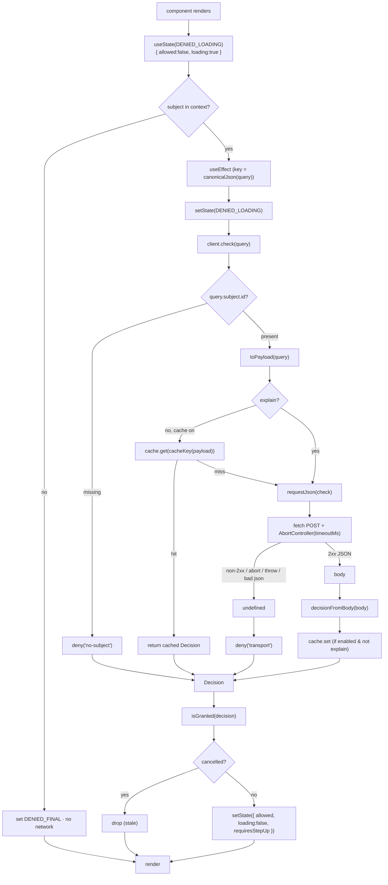

This page follows a single `usePermission` call from the first render to the rendered verdict, naming every function and every fork along the way. It's the runtime companion to the [Architecture overview](/architecture/overview).

## The whole path

## Step by step

::: steps
1. **Render & denied seed**
   The hook initialises to `DENIED_LOADING` (`{ allowed:false, loading:true }`). First paint is a denial — no allow window exists. (`hooks.ts`)

2. **Subject short-circuit (`usePermission`)**
   If the provider has no `subject`, the effect sets `DENIED_FINAL` and returns **without any network call**. (`hooks.ts`)

3. **Stable effect key**
   The effect depends on `canonicalJson(query)` — a sorted, recursive serialisation — not the object reference, so identical queries don't refetch. It calls `setState(DENIED_LOADING)` again before fetching. (`hooks.ts`)

4. **`client.check` — subject guard**
   `check` denies `'no-subject'` if `query.subject.id` is falsy, before building anything. (`client.ts`)

5. **Serialise to the wire payload**
   `toPayload` maps the query to the exact server shape: `subject` (with `type` defaulted to `'user'`), `permission`, explicit `null`s for `organization`/`application`/`resource`, `context` (default `{}`), `current_aal` (default `'aal1'`), `explain`. (`client.ts`)

6. **Cache lookup (skipped for `explain`)**
   When the cache is enabled and the query isn't an `explain`, `check` looks up `cacheKey(payload)` (canonical JSON). A fresh hit short-circuits the network. (`client.ts` + `cache.ts`)

7. **The request, with a deadline**
   `requestJson` POSTs JSON with `Accept`/`Content-Type` and (if a token is set) `Authorization: Bearer`. An `AbortController` fires after `timeoutMs` (default 2000). Non-2xx, an abort, a thrown fetch, or unparseable JSON all yield `undefined`; with `retries > 0`, idempotent network errors retry. (`client.ts`)

8. **Transport failure → deny**
   `check` turns `undefined` into `deny('transport')`. (`client.ts` + `decision.ts`)

9. **Normalise the body**
   `decisionFromBody` unwraps the `{ data }` envelope and reads each field with safe defaults (`allowed` only on literal `true`, etc.). (`decision.ts`)

10. **Cache the real verdict**
    On a real (non-transport) decision with the cache on and not `explain`, `cache.set` stores it — flushing the whole cache first if `policyVersion` increased. (`cache.ts`)

11. **Reduce & map to state**
    Back in the hook, `isGranted(decision)` (`allowed && !requiresStepUp`) becomes `allowed`; `requiresStepUp` is surfaced; `loading` is `false`. The `cancelled` guard drops the update if the query re-keyed or the component unmounted. (`hooks.ts` + `decision.ts`)
:::

## Where each deny comes from

| Origin | Function | Result |
|---|---|---|
| Logged-out / no subject in context | `usePermission` effect | `DENIED_FINAL`, no network |
| Empty `subject.id` | `IamClient.check` | `deny('no-subject')` |
| Timeout / abort | `requestJson` → `check` | `deny('transport')` |
| Non-2xx response | `requestJson` → `check` | `deny('transport')` |
| Unparseable JSON | `requestJson` → `check` | `deny('transport')` |
| Non-object body | `decisionFromBody` | `deny('invalid body')` |
| Missing `allowed` field | `decisionFromBody` | `allowed: false` |
| Allowed but step-up pending | `isGranted` | `allowed: false` (UI prompts) |
| Stale/late resolution | `cancelled` guard | update dropped |

Every row lands on `allowed: false`. There is exactly one way to `allowed: true`: a 2xx body that normalises to `allowed && !requiresStepUp`, delivered before the query re-keys.

## `verifyToken` is the one exception path

`verifyToken` does **not** return a value on failure — it **rejects** with `TokenVerificationError` (audience missing, bad signature, wrong claims, JWKS unreachable). It follows its own flow (mandatory-audience guard → JWKS resolve with 10-min cache → ES256 verify → one refetch on key-rotation). See [Verifying tokens](/guides/verifying-tokens).

## Next steps

- [Wire contract](/architecture/wire-contract) — the payload and envelope in detail.
- [The hook lifecycle](/concepts/hook-lifecycle) — the React state machine.
- [The decision model](/concepts/decision-model) — normalisation and `isGranted`.
