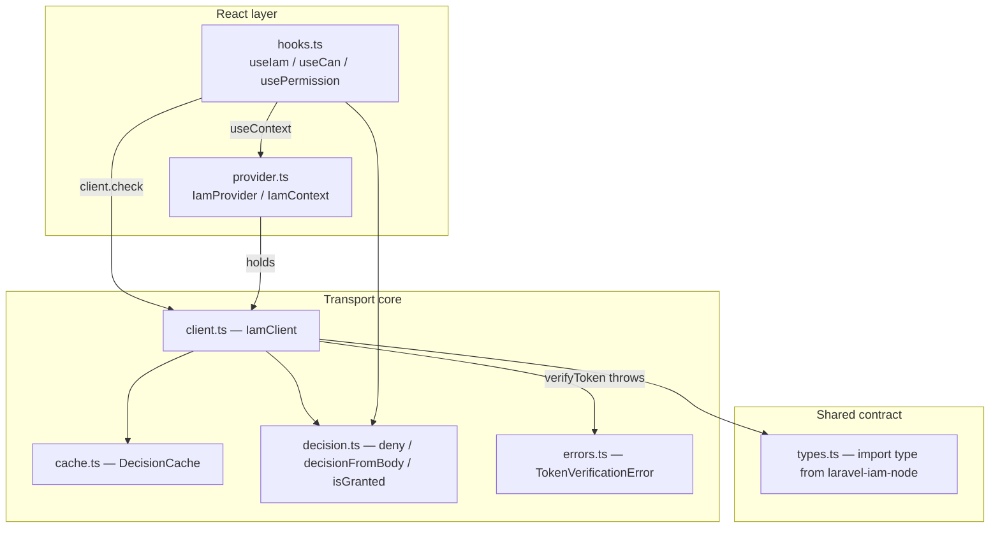

The SDK is small and layered: a transport core, a React skin over it, and a few pure helpers. This page maps the source files to responsibilities so the deep pages have a shared mental model.

## The modules

| File | Responsibility |
|---|---|
| `src/client.ts` | `IamClient`: transport (`check`/`can`/`listResources`), JWKS `verifyToken`, timeouts, retries, the JWKS cache. |
| `src/cache.ts` | `DecisionCache` + `cacheKey`: the RN-safe (canonical-JSON) in-memory decision cache. |
| `src/decision.ts` | Pure helpers: `deny`, `decisionFromBody` (normalise), `isGranted` (reduce). |
| `src/provider.ts` | `IamProvider` + `IamContext`: puts `{ client, subject }` into React context. |
| `src/hooks.ts` | `useIam`, `useCan`, `usePermission`: the fail-closed React state machine. |
| `src/errors.ts` | `TokenVerificationError`: the fail-closed signal for `verifyToken`. |
| `src/types.ts` | `IamClientConfig`, `PermissionState` + the `import type` re-exports of the wire types. |
| `src/index.ts` | Public surface — what consumers import. |

## How the layers stack

The dependency arrows point inward: React depends on the core, the core depends only on the (erased) wire types and `jose`. Nothing in the core imports React, so `IamClient` is usable imperatively without any provider.

## Two responsibilities, cleanly split

- **`IamClient` is framework-agnostic.** It is a plain class that does HTTP + crypto and never touches React. You can `new IamClient(...)` in a script, a test, or a non-React surface.
- **The hooks are a thin reactive adapter.** `usePermission`/`useCan` only orchestrate `useState`/`useEffect` around `client.check`, applying `isGranted` and the cancellation guard. All the security lives in the core.

::: callout tip "You can use the core without the React layer" icon:box
Need a one-off check in a saga, a navigation guard, or a background task? Pull `client` from `useIam()` (or pass your instance directly) and call `client.check`/`client.can`/`client.verifyToken`. The hooks are convenience, not a gate you must pass through.
:::

## The fail-closed seams

Every place uncertainty can enter has a deny on the inside edge:

- **Construction** — `client.ts` rejects a non-absolute `baseUrl` (would silently disable the issuer check) and a missing `fetch`.
- **Transport** — `requestJson` returns `undefined` on non-2xx / unparseable / aborted; `check` turns that into `deny('transport')`.
- **Normalisation** — `decisionFromBody` defaults missing/wrong-typed fields to safe values; a non-object body is `deny('invalid body')`.
- **Reduction** — `isGranted` folds in step-up before anything is treated as allow.
- **React** — hooks seed and re-assert the denied state, and drop stale resolutions.

See [Hook → client → server flow](/architecture/decision-flow) for the runtime trace and [ADR](/architecture/decisions) for the decisions behind these seams.

## Build & distribution

Built with `tsup` to **ESM + CommonJS + `.d.ts`** (and `.d.cts`), `sideEffects: false` for tree-shaking. Runtime deps: `jose` and the type-only `@padosoft/laravel-iam-node`. Peer deps: `react >=18`, `react-native >=0.71` (optional). See [Installation](/installation).

## Next steps

- [Hook → client → server flow](/architecture/decision-flow) — the end-to-end runtime path.
- [Wire contract](/architecture/wire-contract) — the bytes between client and PDP.
- [ADR](/architecture/decisions) — the load-bearing decisions.
