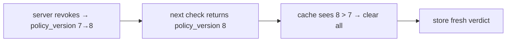

The [decision cache](/guides/caching) is a latency tool, not a correctness one. Used well it makes a chatty mobile UI cheap; used carelessly it widens the window in which a revoked permission still reads as allowed. This page is how to use it well.

## What the cache can and cannot do

::: callout success "It can only shorten the life of an allow — never manufacture one" icon:shield-check
By construction the cache stores only real server verdicts, never transport-error denies; skips `explain`; and flushes wholesale on a newer `policyVersion`. So the worst it can do is serve a slightly stale **allow** (bounded by `ttlMs`) — it can never turn a deny into an allow, nor revive an outage-era deny. See [the cache ADR](/architecture/decisions).
:::

## Choosing a TTL

The TTL is a direct trade between **calls saved** and **staleness of an allow**:

$$
\text{max staleness of an allow} \;=\; \min\big(\texttt{ttlMs},\ \text{time to next policy bump}\big)
$$

| Surface | Suggested `ttlMs` | Why |
|---|---|---|
| Hot list rows, tab bars, headers re-checking the same permission | `2000`–`5000` | Collapses bursts; a few seconds of staleness is harmless for visibility toggles. |
| Ordinary screens | `1000`–`3000` | Modest relief, tight freshness. |
| Sensitive/destructive actions (funds, security settings, admin) | `0` (off) or `≤ 1000` | Prefer a live verdict; never cache a high-stakes allow for long. |

::: callout warning "Seconds, not minutes" icon:timer
A long TTL means a just-revoked permission can still read as allowed until the entry expires **or** the policy version bumps. Keep it short; reserve longer TTLs for low-stakes visibility decisions only.
:::

## The revocation story

There are two ways a stale allow ends:

1. **TTL expiry** — the entry simply ages out after `ttlMs`.
2. **Policy-version flush** — when the server returns a decision whose `policyVersion` is higher than any the cache has seen, the **entire cache is cleared** before the new entry is stored.

So a revocation that the server records as a policy change is reflected on the **very next** decision the app fetches, regardless of TTL. A revocation that does *not* bump the version is bounded by `ttlMs` alone — another reason to keep it short.



## Don't cache what shouldn't be cached

Two categories are excluded **for you** — don't try to defeat it:

- **`explain` queries** bypass the cache on read and write, so a diagnostic always reflects live policy. Use `explain: true` (via `useCan`/`client.check`) when you need the *current* reasoning, not a cached verdict.
- **Transport-error denies** are never stored; a deny born of an outage must not outlive it.

## Shared devices: reset on logout

The cache is **in-memory and per-client**, keyed by the full query (subject included). A different subject simply misses the cache — but to be strict on a device that serves multiple users, drop the cached state on logout:

```ts
// simplest: build a fresh client when the user changes
function makeClient() {
  return new IamClient({ baseUrl, token, cache: { ttlMs: 3000 } });
}
// on logout: setClient(makeClient())  → old cache is garbage-collected
```

(If you keep one long-lived client, the cache's `clear()` empties it; constructing a fresh client is the simplest guaranteed reset.)

## `maxEntries` and memory

The cache is bounded by `maxEntries` (default 1000) with FIFO eviction — the oldest entry goes first when full. For a mobile app this is plenty; lower it if you cache many distinct resource-scoped permissions and want a tighter footprint.

## Worked example: a tuned client

```ts
const iam = new IamClient({
  baseUrl: 'https://iam.example.com/api/iam/v1',
  token: process.env.IAM_SERVICE_TOKEN,
  timeoutMs: 2000,
  retries: 1,                       // ride out a single transient blip
  cache: { ttlMs: 3000, maxEntries: 500 },
});

// For a destructive action, force freshness by bypassing the cache:
const live = await iam.check({ subject, permission: 'account.close', explain: true });
```

## Gotchas

::: callout warning "explain bypasses the cache — don't use it as your default check"
`explain: true` always hits the network. It's for diagnostics or forcing a fresh high-stakes verdict, not for every render — that would defeat the cache entirely.
:::

::: callout warning "Re-check after step-up; don't trust a pre-elevation cached deny"
A step-up changes `currentAal`, which is part of the cache key — so pass the new AAL and the check is a fresh key. If you forget to update `currentAal`, you'll re-serve the old (denied) entry.
:::

## Next steps

- [Caching decisions](/guides/caching) — the mechanics and the key.
- [Fail-closed discipline](/best-practices/fail-closed-discipline) — the rules a cache must not break.
- [The decision model](/concepts/decision-model) — what `policyVersion` is.
