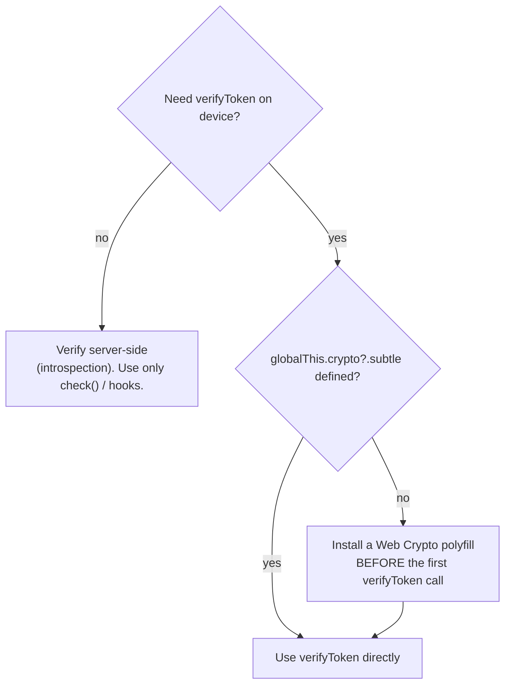

`check()` and the hooks need only `fetch`. **`verifyToken` needs the Web Crypto API.** This page is the one caveat that most often bites at deploy time, with a clear decision tree.

## Why `verifyToken` needs Web Crypto

ES256 is asymmetric (ECDSA over P-256). `jose` verifies the signature using the standard **Web Crypto API** — `globalThis.crypto.subtle`. This SDK deliberately does **not** use `node:crypto` (Hermes has none — see [RN-safe](/concepts/rn-safe)), so the runtime must provide `crypto.subtle`.

::: callout info "Only verifyToken is affected" icon:info
`check`, `can`, `listResources`, `usePermission`, `useCan`, `useIam` use plain `fetch` and have **no** crypto dependency. If your app never calls `verifyToken` (e.g. it verifies tokens server-side), none of this applies.
:::

## Availability by runtime

| Runtime | `crypto.subtle`? | `verifyToken` |
|---|---|---|
| **React Native ≥ 0.71 (Hermes)** | yes | works out of the box |
| **Expo (recent SDKs, Hermes)** | yes | works out of the box |
| **React (web, modern browser)** | yes | works out of the box |
| **RN "bare" / older Hermes / JSC without WebCrypto** | maybe missing | **polyfill or verify server-side** |
| **Custom/old embedded JS engine** | often missing | **polyfill or verify server-side** |

## The decision tree



::: steps
1. **Do you need to verify on the device at all?**
   If your backend can introspect/verify the token and the app only needs authorization (`check`/hooks), prefer **server-side verification** and skip Web Crypto entirely.

2. **Is `crypto.subtle` available?**
   Detect it (below). On RN ≥ 0.71 / Expo / web it generally is.

3. **If missing, polyfill before first use.**
   Install a Web Crypto / `SubtleCrypto` polyfill (e.g. `react-native-quick-crypto` or an equivalent shim) and ensure it's imported at app startup, **before** any `verifyToken` call.
:::

## Detecting availability

```ts
export function hasWebCrypto(): boolean {
  return typeof globalThis.crypto?.subtle?.importKey === 'function';
}

// Guard your call site:
if (!hasWebCrypto()) {
  // fall back to server-side verification, or surface a clear setup error
}
```

A missing `crypto.subtle` doesn't fail silently — `verifyToken` will **reject** with a `TokenVerificationError` whose `reason` reflects the underlying crypto failure. That's still fail-closed (a rejection is a deny), but detecting up front gives a clearer message than a generic verification failure.

## Polyfill placement matters

::: callout warning "Import the polyfill before the first verifyToken — ideally at entry point" icon:triangle-alert
`jose` reads `globalThis.crypto.subtle` when it runs. If the polyfill is installed *after* a `verifyToken` call has already executed, that call fails. Put the polyfill import at the very top of your app entry (`index.js` / `App.tsx`) so `crypto.subtle` exists before any verification.
:::

## The server-side alternative (often the simplest)

If Web Crypto is a hassle on your target devices, don't fight it — verify tokens where you already run Node/PHP:

- The app sends the token to **your** backend; the backend verifies it (with `@padosoft/laravel-iam-node` or the PHP client) or calls the IAM server's **introspection** endpoint.
- The app uses only `check()` / hooks on device — no crypto needed.

This keeps the device thin and moves the one crypto-dependent operation to a runtime that always has crypto.

## Gotchas

::: callout warning "verifyToken rejecting on a healthy token? Check crypto.subtle first"
A valid token that rejects with no obvious claim error is very often a missing/late Web Crypto polyfill, not a bad token. Verify `globalThis.crypto?.subtle` exists at the call site.
:::

::: callout warning "Don't polyfill node:crypto to 'fix' this"
The fix is a **Web Crypto** (`crypto.subtle`) polyfill, not a `node:crypto` shim. This SDK never imports `node:crypto`; shimming it does nothing for `verifyToken`.
:::

## Next steps

- [RN-safe: no node:crypto](/concepts/rn-safe) — why verification is on Web Crypto.
- [Verifying tokens (JWKS)](/guides/verifying-tokens) — the full verification flow.
- [Installation](/installation) — the runtime floor and Expo notes.
