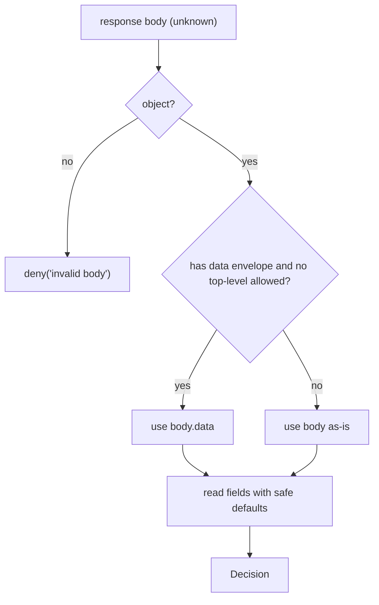

Every authorization check — imperative or via a hook — resolves to one normalised shape: a `Decision`. This page defines each field, shows how the SDK derives it safely from the server's JSON, and explains the reduction the hooks apply on your behalf.

## The shape

```ts
interface Decision {
  allowed: boolean;            // the PDP's raw verdict
  decisionId: string;          // server correlation id (audit)
  policyVersion: number;       // monotonic policy generation
  requiresStepUp: boolean;     // allowed-but-needs-higher-AAL
  requiredAal: string | null;  // the AAL needed, e.g. 'aal2'
  matched: DecisionMatch[];    // which rules matched (diagnostics)
  explanation: string[];       // human/debug reasons
}
```

| Field | Type | Meaning |
|---|---|---|
| `allowed` | `boolean` | The PDP's raw yes/no. **Necessary but not sufficient** — see `requiresStepUp`. |
| `decisionId` | `string` | Opaque correlation id to tie a UI action to a server audit record. |
| `policyVersion` | `number` | Increments when policy changes; the [cache](/guides/caching) flushes when it sees a higher value. |
| `requiresStepUp` | `boolean` | `true` → the action is only permitted at a higher assurance level. |
| `requiredAal` | `string \| null` | The required Authenticator Assurance Level (e.g. `aal2`), or `null`. |
| `matched` | `DecisionMatch[]` | The rules/relationships that produced the verdict — diagnostics, not for branching. |
| `explanation` | `string[]` | Reason breadcrumbs (`transport`, `no-subject`, server-side notes). Observe, don't authorize on. |

## From server body to `Decision`: safe by construction

The server wraps its response in an envelope: `{ "data": { …decision… } }`. The SDK's `decisionFromBody` unwraps it and reads each field **defensively** — anything missing or wrong-typed degrades to the safe value, never the permissive one.



The safe defaults:

| Field | Rule | Safe default |
|---|---|---|
| `allowed` | only `true` when the body's `allowed === true` | `false` |
| `requiresStepUp` | only `true` when `requires_step_up === true` | `false` |
| `decisionId` | string or empty | `''` |
| `policyVersion` | number or zero | `0` |
| `requiredAal` | string or null | `null` |
| `matched` | array of objects, others dropped | `[]` |
| `explanation` | array of strings, others dropped | `[]` |

::: callout success "A missing allowed is a deny, not an allow" icon:shield-check
The single most important default: if the server's `allowed` field is absent or not the boolean `true`, the normalised `allowed` is `false`. A truncated or partial body can never be read as permission.
:::

Note the snake-case → camelCase mapping (`requires_step_up` → `requiresStepUp`, `required_aal` → `requiredAal`, `decision_id` → `decisionId`, `policy_version` → `policyVersion`) — the wire is snake-case for byte-parity with the PHP/Node clients. See [Wire contract](/architecture/wire-contract).

## The reduction: `isGranted`

`allowed` alone is not permission. The fail-safe reduction folds in step-up:

$$
\text{isGranted}(d) \;=\; d.\text{allowed} \;\land\; \lnot\, d.\text{requiresStepUp}
$$

- **`client.can(query)`** returns `isGranted(await check(query))` — the boolean you should gate on imperatively.
- **The hooks apply it for you**: `usePermission` / `useCan` set `allowed: isGranted(decision)`, and separately surface `requiresStepUp` so you can prompt a step-up.

## How a `Decision` becomes `PermissionState`

```ts
// inside the hooks, on a resolved decision:
setState({
  allowed: isGranted(decision),      // allowed && !requiresStepUp
  loading: false,
  requiresStepUp: decision.requiresStepUp,
});
```

So the UI sees a three-field `PermissionState` (see [The hook lifecycle](/concepts/hook-lifecycle)), while the full `Decision` remains available imperatively via `useIam().client.check(...)` when you need `decisionId`, `matched`, or `explanation`.

## Worked example

Server returns:

```json
{ "data": { "allowed": true, "requires_step_up": true, "required_aal": "aal2", "policy_version": 7 } }
```

Normalised `Decision`:

```ts
{ allowed: true, requiresStepUp: true, requiredAal: 'aal2', policyVersion: 7,
  decisionId: '', matched: [], explanation: [] }
```

`isGranted` → `true && !true` → **`false`**. A hook renders this as `{ allowed: false, requiresStepUp: true }` — _"the policy would allow it, but step up first"_.

## ADR: degrade unknown bodies to deny, never to allow

::: collapsible "Problem → Decision → Consequences"
**Problem.** A network or proxy can hand back a partial, reordered, or wrong-typed JSON body. If normalisation trusted those fields optimistically, a garbage body could read as `allowed: true`.

**Decision.** `decisionFromBody` reads every field with an explicit type check and a safe default; a non-object body becomes `deny('invalid body')`. `allowed` is `true` only for a literal boolean `true`.

**Consequences.** No malformed response can manufacture permission; the worst a bad body does is deny. The cost is that a server contract change (new field) is silently ignored until the SDK adds it — acceptable, since ignoring is the safe direction.
:::

## Next steps

- [Step-up & AAL](/concepts/step-up-aal) — the `requiresStepUp` / `requiredAal` pair in depth.
- [Wire contract](/architecture/wire-contract) — the exact request/response bytes.
- [Types](/reference/types) — `Decision`, `DecisionMatch`, and the rest.
