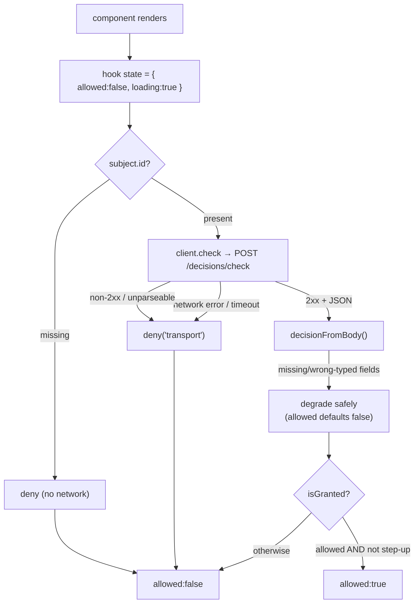

Fail-closed is not a feature of this SDK — it is its **shape**. Every method, every hook state, every error branch, every default exists to uphold one rule. This page makes that rule precise for a React Native client, where _"still loading"_ is itself a form of uncertainty.

## The invariant

> **A request is permitted only on a positive, fresh, authenticated grant from the PDP. Every other outcome — error, timeout, non-2xx, malformed body, missing subject, unverifiable token, pending step-up, _or a check still in flight_ — is a denial.**

Formally, let the SDK's effective verdict be $V$. Define _granted_ as:

$$
\text{granted} \iff \big(\text{PDP responded } 2xx\big) \;\land\; \text{resolved} \;\land\; \text{allowed} \;\land\; \lnot\,\text{requiresStepUp}
$$

Then the SDK guarantees:

$$
V = \begin{cases} \textsf{allow} & \text{if } \text{granted} \\ \textsf{deny} & \text{otherwise} \end{cases}
$$

There is no third branch and no fail-open override. The default value of authorization is **deny**, and access is the exception that must be positively earned. The added conjunct `resolved` is the React-specific clause: an unresolved (loading) check is **not** granted.

## Why "fail-closed" and not "fail-open"

A **fail-open** system grants access when it cannot reach the authority. It optimises availability of the _feature_ at the cost of the _security boundary_. On a mobile client the failure mode is doubly bad: not only does an unreachable PDP swing every gate open, but a UI that renders privileged controls **optimistically while loading** flashes them on screen before any answer arrives — a tappable fail-open window.

A **fail-closed** system denies when it cannot (yet) reach the authority. Its failure mode is loud and safe: controls stay hidden or disabled, a spinner shows, the user retries — but **no unauthorised action is ever offered**.

::: callout danger "Fail-open is an outage-to-breach pipeline"
Fail-open converts your **most common** failure (a dependency briefly unreachable, or simply a request in flight) into your **worst** outcome (an unauthorised action offered and taken), automatically, with no human in the loop. Fail-closed converts the same common failure into a benign "you can't do that right now".
:::

## The threat model (mobile edition)

Fail-closed defends against this set of realities, none exotic:

| Reality | Fail-open outcome | Fail-closed outcome |
| --- | --- | --- |
| PDP briefly down / deploying | All actions offered | All denied |
| Flaky mobile network / radio handoff | Offered | Denied (spinner, retry) |
| Check still in flight (first render) | **Control flashes, tappable** | Hidden/disabled until resolved |
| PDP returns 500 / 503 | Offered (or crash) | Denied |
| PDP returns truncated/garbage body | Offered (parsed permissive) | Denied |
| User logged out (no subject) | Offered (empty subject) | Denied, **no network call** |
| Token minted for another app | Accepted (aud skipped) | Rejected (audience mandatory) |
| Allowed but needs step-up | Acted on immediately | Held until step-up |

Every row is a way the system can be _uncertain_. The invariant says: uncertainty resolves to deny.

## How every path funnels to deny

The SDK has exactly one constructor for an allow (a normalised positive decision, reduced through `isGranted`) and **many** funnels into deny.

A few load-bearing details:

- **`deny()` is the single sink.** No-subject, transport failure, malformed body — all build the same explicit deny `Decision` (`allowed: false`, empty everything). It mirrors the PHP/Node clients; there is no fail-open opt-out.
- **Hooks start denied.** `useState(DENIED_LOADING)` means the first paint is always deny; the effect re-asserts deny before each fetch and only sets allow on a granted decision.
- **Stale responses are dropped.** A `cancelled` flag in the effect ignores a late response after the query changed or the component unmounted — a slow allow for an old query can never overwrite a newer state.
- **`check()` never throws.** Throwing would tempt a caller into `try { if (await check()) … } catch { allow() }`. By always returning a `Decision`, the only way to read it is to honour the verdict.
- **Synthetic denies are never cached.** A deny born of an outage must not outlive it.

## ADR: never throw from `check()`

::: collapsible "ADR — check() returns a Decision and never throws"
**Problem.** An authorization call can fail for transport reasons. If it signals failure by throwing, callers write `try { if (await check()) … } catch { /* ??? */ }` — and under deadline pressure the catch tends to swallow-and-continue (fail-open).

**Decision.** `check`, `can`, `listResources` never throw. Every failure folds into the return value (a deny `Decision`, `false`, `[]`). Only `verifyToken` rejects — a token has no safe value, so rejection is the unambiguous deny signal there.

**Consequences.** Callers cannot accidentally fail open by mishandling an exception, because there is none. "Denied" and "couldn't reach the PDP" look identical at the call site, by design; observability reads `explanation` (`transport`, `no-subject`) but must never branch authorization on it.
:::

## ADR: loading is part of the deny set

::: collapsible "ADR — the hooks treat in-flight as deny"
**Problem.** A check takes a network round-trip. If a hook returned `allowed: true` (or `undefined` coerced as truthy) before the answer arrived, the UI would render the privileged control during loading — a fail-open flash.

**Decision.** The permission hooks initialise to `{ allowed: false, loading: true }` and only ever set `allowed: true` after a granted decision resolves. Loading and error both carry `allowed: false`.

**Consequences.** A component that renders on `allowed` is fail-closed for free; the worst a loading state does is hide a control the user is in fact allowed to use (a brief, safe degradation). See [The hook lifecycle](/concepts/hook-lifecycle).
:::

## What fail-closed costs you (and why it's worth it)

When the PDP is unreachable — or just slow — your users **cannot perform protected actions** for that moment. That's a real availability/latency cost, and the honest answer is: yes, that's the trade. The mitigations are operational, not a fail-open switch — keep the PDP highly available, set a sane timeout (default 2s), enable a short [decision cache](/guides/caching) to ride out blips on hot paths, and show good loading/empty states so the degradation reads as "not yet" rather than "broken". None of those weaken the invariant; they reduce how often you hit it.

## Gotchas

::: callout warning "Don't reintroduce fail-open at the call site"
The SDK is fail-closed, but you can undo it in one line: rendering a control during `loading`, gating on raw `decision.allowed` (ignoring step-up), `catch (e) { allow() }` around `verifyToken`, or treating `listResources` `[]` as "no restrictions". The invariant holds **inside** the SDK; honour it **outside** too. See [Fail-closed discipline](/best-practices/fail-closed-discipline).
:::

## Next steps

- [The hook lifecycle](/concepts/hook-lifecycle) — the loading → deny → allow state machine.
- [The decision model](/concepts/decision-model) — what a normalised verdict contains.
- [Step-up & AAL](/concepts/step-up-aal) — why `allowed` isn't `granted`.
