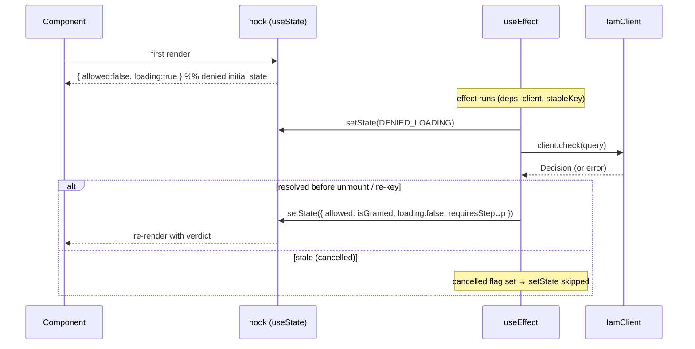
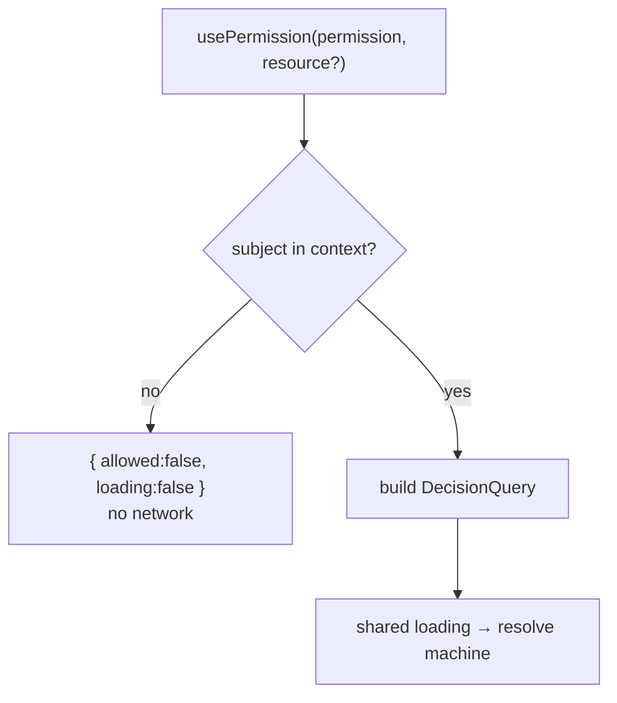

The two permission hooks share one small, carefully-ordered state machine. This page traces it render-by-render so you can reason about exactly what your UI shows at each moment — and why every intermediate state is a denial.

## The state it exposes

Both `usePermission` and `useCan` return a `PermissionState`:

```ts
interface PermissionState {
  allowed: boolean;        // true ONLY when granted AND not loading. false otherwise.
  loading: boolean;        // true while the PDP check is in flight
  requiresStepUp: boolean; // true when the PDP allowed but a higher AAL is required
}
```

There are only three reachable shapes, and two of the three are denials:

| State | `allowed` | `loading` | `requiresStepUp` | Meaning |
|---|---|---|---|---|
| **Loading** | `false` | `true` | `false` | check in flight — **deny** |
| **Granted** | `true` | `false` | `false` | positive, fresh decision — **allow** |
| **Denied** | `false` | `false` | `*` | deny / error / step-up — **deny** |

## The lifecycle, step by step



### 1. Denied initial state

`useState<PermissionState>(DENIED_LOADING)` seeds the hook with `{ allowed: false, loading: true, requiresStepUp: false }`. The very first paint — before any effect or network — is already a denial. There is no window in which the component sees `allowed: true` "by default".

### 2. The effect re-asserts deny, then asks

When the effect runs it calls `setState(DENIED_LOADING)` **before** the network call, then `client.check(query)`. So any transition into a new query starts from deny, never from a stale allow.

### 3. Resolve to the verdict

On success the effect sets `allowed: isGranted(decision)` (i.e. `decision.allowed && !decision.requiresStepUp`), `loading: false`, and surfaces `requiresStepUp`. On a rejected promise it sets the final denied state `{ allowed: false, loading: false, requiresStepUp: false }`.

### 4. The `cancelled` race guard

Each effect run captures a local `cancelled = false` and returns a cleanup that sets `cancelled = true`. The `.then`/`.catch` handlers no-op when `cancelled` is set. This defends against two classic React races:

- **Re-key mid-flight** — the query changed and a new check started; the old check's late response must not overwrite the new state.
- **Unmount mid-flight** — the component is gone; setting state would warn and is meaningless.

::: callout success "A slow allow can never overwrite a newer deny" icon:shield-check
Because stale resolutions are dropped, a sluggish "allow" for a query you've already navigated away from cannot flash a control for the wrong context. Order is preserved by identity, not by timing.
:::

## The stable query key (no refetch storms)

A `DecisionQuery` is an object literal: its reference changes every render. If the effect depended on the object, it would re-run on **every** render — a refetch storm. Instead the hooks compute a **canonical JSON** serialisation of all query inputs and use that *string* as the effect dependency:

```ts
// inside the hook
const queryKey = stableKey(query); // canonical JSON: sorted keys, recursive
useEffect(() => { /* ...check... */ }, [client, queryKey]);
```

Identical queries across renders yield the same `queryKey` and skip the refetch; a genuine change produces a new key and re-runs. This is the same order-independent canonical-JSON technique the [decision cache](/guides/caching) uses for its key — see [RN-safe](/concepts/rn-safe).

::: callout tip "Pass inline object literals freely" icon:check
Because the dependency is the serialised key, you do **not** need to `useMemo` the query object. `usePermission('p', { type: 't', id })` is fine inline.
:::

## The `usePermission` short-circuits

`usePermission` adds two convenience behaviours on top of the shared machine:

- **No subject → immediate deny, no network.** If the provider has no `subject` (e.g. logged out), the effect sets the final denied state and returns without calling the PDP. Fail-closed for anonymous users, and zero wasted requests.
- **Subject from context.** It composes the query from the context `subject` plus your `permission` / `resource` / `extra`, then runs the identical lifecycle as `useCan`.



## Worked example: reading the three states explicitly

```tsx
function DangerButton({ id }: { id: string }) {
  const { allowed, loading, requiresStepUp } = usePermission('item.delete', { type: 'item', id });

  if (loading)        return <ActivityIndicator />;                         // deny (in flight)
  if (requiresStepUp) return <Button title="Verify to delete" onPress={stepUp} />; // deny (needs AAL)
  if (!allowed)       return null;                                          // deny (final)
  return <Button title="Delete" color="red" onPress={() => del(id)} />;     // allow
}
```

Every branch except the last is a denial; the privileged control is reachable only through `allowed === true`.

## Gotchas

::: callout warning "Don't destructure only allowed and render on it during loading"
`const { allowed } = usePermission(...)` then rendering the control when `allowed` — fine, because `allowed` is `false` during loading. But if you invert to "render unless explicitly denied", you'll render during loading. Gate **positively** on `allowed`.
:::

::: callout warning "The hook re-checks on every query change — keep inputs stable in meaning, not reference"
Changing `permission`/`resource`/`extra` values re-keys and re-checks (correct). Passing the *same values* via new object references does **not** re-check (the key is canonical). Don't rely on reference identity either way.
:::

## Next steps

- [Fail-closed by design](/concepts/fail-closed) — why loading belongs to the deny set.
- [Checking permissions with hooks](/guides/checking-permissions) — using the machine in practice.
- [Step-up & AAL](/concepts/step-up-aal) — the `requiresStepUp` branch.
