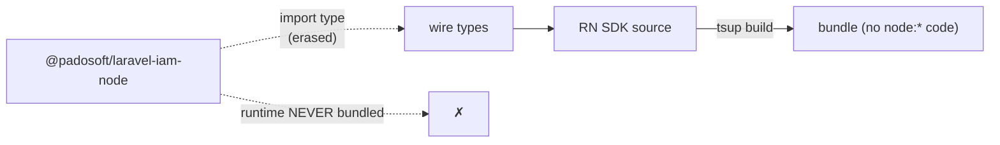

This SDK exists as a distinct package from `@padosoft/laravel-iam-node` for one reason: **React Native's JS engine has no Node built-ins**. This page explains the constraint and the three concrete adaptations that satisfy it — without giving up the shared wire contract.

## The constraint: Hermes has no `node:*`

React Native runs on **Hermes**, a JS engine that does not implement Node's standard library. There is no `node:crypto`, no `node:fs`, no `node:buffer`. Importing any of them — even **transitively**, through a dependency — throws at runtime the moment the module graph is evaluated.

::: callout danger "A single transitive node:crypto import crashes the app" icon:triangle-alert
The Node SDK's decision cache uses `createHash('sha256')` from `node:crypto`. If this React Native package imported the Node SDK's **runtime**, that import alone would crash on device. So the boundary between "shared types" and "shared code" has to be airtight.
:::

## Adaptation 1 — `import type` only: types shared, runtime not

The wire vocabulary (`Subject`, `Resource`, `Decision`, `DecisionQuery`, `Claims`, `VerifyOptions`, `CacheOptions`, …) is defined once in the Node SDK and **re-exported here with `import type`**:

```ts
import type { Decision, DecisionQuery, Claims } from '@padosoft/laravel-iam-node';
```

With TypeScript's `verbatimModuleSyntax`, a `import type` is **erased at build time** — it produces *no* JavaScript. The compiled bundle has no `require('@padosoft/laravel-iam-node')`, so none of its runtime (and none of its `node:crypto`) is ever loaded on the device. You get one source of truth for the contract and zero runtime coupling.



## Adaptation 2 — the cache key is canonical JSON, not SHA-256

The Node SDK derives its cache key by hashing the query with `node:crypto` SHA-256. Here the key is a **canonical JSON** serialisation instead — recursive, with object keys **sorted** so order doesn't matter:

```ts
function canonicalJson(value: unknown): string {
  if (value === null || typeof value !== 'object') return JSON.stringify(value ?? null);
  if (Array.isArray(value)) return `[${value.map(canonicalJson).join(',')}]`;
  const obj = value as Record<string, unknown>;
  const keys = Object.keys(obj).sort();
  return `{${keys.map((k) => `${JSON.stringify(k)}:${canonicalJson(obj[k])}`).join(',')}}`;
}
```

For an in-memory `Map` keyed cache this is **functionally identical** to a hash: the same query always yields the same string, and two queries differing only in property order collide intentionally (they *are* the same query). The key is longer than a 64-char digest, but entries are bounded (`maxEntries`, default 1000) so memory stays in check.

::: callout tip "The hooks use the same trick" icon:repeat
`usePermission` / `useCan` key their `useEffect` on the same `canonicalJson` of the query inputs — that's what stops object-literal queries from causing refetch storms. One technique, two uses (cache key and effect key). See [The hook lifecycle](/concepts/hook-lifecycle).
:::

### Why order-independence matters

| Query A | Query B | Same key? |
|---|---|---|
| `{ permission:'p', subject:{ id:'u', type:'user' } }` | `{ subject:{ type:'user', id:'u' }, permission:'p' }` | **yes** |
| `{ permission:'p', resource:null }` | `{ permission:'p' }` | no (`resource:null` ≠ absent) |

Sorting keys before serialising guarantees the first row collides; the SDK builds the payload uniformly so equivalent checks share an entry.

## Adaptation 3 — token verification on Web Crypto

ES256 signature verification needs a crypto primitive. Instead of Node crypto, `verifyToken` uses [`jose`](https://github.com/panva/jose) over the **Web Crypto API** (`globalThis.crypto.subtle`) — a browser/standard API that Hermes exposes from **React Native 0.71+** and that Expo provides.

This keeps verification inside the RN sandbox, but it does impose a runtime floor: where `crypto.subtle` is missing (older Hermes, some bare builds), `verifyToken` can't run and you must polyfill or verify server-side. See [Hermes & Web Crypto](/best-practices/hermes-web-crypto). The `fetch`-only paths (`check`, `can`, `listResources`, all hooks) have **no** crypto requirement.

## What stays identical to the Node SDK

The adaptations are *implementation*; the **observable behaviour is the same**:

- same slash endpoint and payload (`current_aal`, explicit nulls), Bearer auth, `{ data }` envelope unwrap;
- same fail-closed funnel (`deny()` sink, never-throw `check`, safe normalisation);
- same cache semantics (off by default, short TTL, no transport-error caching, no `explain` caching, policy-version flush);
- same mandatory audience and ES256 pinning on `verifyToken`.

A server (and an auditor) cannot tell a React Native caller from a Node or PHP one. See [Wire contract](/architecture/wire-contract).

## ADR: a sibling package, not a conditional export

::: collapsible "Problem → Decision → Consequences"
**Problem.** One package could try to serve both Node and RN via conditional exports / runtime feature-detection of `node:crypto`. That risks a bundler pulling the Node branch into an RN build, and makes the dangerous path (a `node:*` import) reachable.

**Decision.** Ship a **separate** React Native package that shares only **types** with the Node SDK (`import type`) and re-implements transport/cache/verification with RN-safe primitives (canonical JSON, Web Crypto). No runtime code crosses the boundary.

**Consequences.** The RN bundle provably contains no `node:*` import; the two SDKs evolve their internals independently while tracking one wire contract. The cost is a little duplicated logic (cache, normalisation) — worth it for a hard runtime guarantee on device.
:::

## Gotchas

::: callout warning "Don't import from @padosoft/laravel-iam-node at runtime in RN"
Re-exporting a *value* (not a type) from the Node SDK would pull its runtime — and its `node:crypto` — into your bundle and crash Hermes. Import only from `@padosoft/laravel-iam-react-native`; the wire types are re-exported here for you.
:::

## Next steps

- [Hermes & Web Crypto](/best-practices/hermes-web-crypto) — the `verifyToken` runtime requirement.
- [Caching decisions](/guides/caching) — the canonical-JSON cache key in practice.
- [Architecture overview](/architecture/overview) — where these adaptations live in the source.
