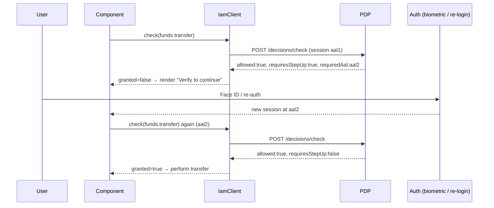

A decision can say _"yes, but only if the user proves themselves more strongly first"_. This is **step-up authentication**, expressed through Authenticator Assurance Levels. Understanding it is the difference between `allowed` and actually **granted**.

## AAL in one paragraph

An **Authenticator Assurance Level** (AAL, from NIST SP 800-63B) grades _how strongly_ a session is authenticated:

| AAL | Roughly |
|---|---|
| `aal1` | Single factor — a password or a long-lived mobile session. |
| `aal2` | Two factors — password + OTP/push, or device biometric re-auth. |
| `aal3` | Hardware-backed, phishing-resistant (e.g. a security key). |

A policy can require a **minimum AAL** for sensitive actions: read your profile at `aal1`, but transfer funds or change security settings only at `aal2+`.

## The two fields

When the PDP would allow an action but the session's AAL is too low, it returns:

```ts
{ allowed: true, requiresStepUp: true, requiredAal: 'aal2', /* … */ }
```

- **`requiresStepUp: true`** — the gate: allowed-in-principle, not-yet-permitted.
- **`requiredAal`** — the target the session must reach (e.g. `aal2`), or `null` when no step-up is needed.

## Why `allowed` alone is a trap

`allowed === true` with `requiresStepUp === true` means the action is **not** currently permitted. Acting on bare `allowed` would let a single-factor session perform an action the policy reserves for two-factor — a real privilege escalation. The fail-safe reduction folds step-up in:

$$
\text{granted} \;=\; \text{allowed} \;\land\; \lnot\,\text{requiresStepUp}
$$

::: callout danger "Never gate on raw decision.allowed" icon:shield-alert
Use `client.can()` (which returns `isGranted`) imperatively, or read `allowed` from the hooks (which already apply `isGranted`). A control rendered on raw `decision.allowed` ignores step-up and opens a sensitive action to an under-assured session.
:::

## The mobile step-up loop

On a phone, "step up" usually means a biometric prompt or a re-authentication that mints a fresher, higher-AAL session/token. The pattern:



The decision is re-evaluated **after** the user elevates — the SDK doesn't "remember" a pending step-up; you re-check, and the now-higher AAL flips `requiresStepUp` to `false`.

## In the hooks

The permission hooks surface step-up as a distinct branch so you can prompt rather than silently hide:

```tsx
function TransferButton({ amount }: { amount: number }) {
  const { allowed, loading, requiresStepUp } =
    usePermission('funds.transfer', null, { context: { amount } });

  if (loading)        return <ActivityIndicator />;
  if (requiresStepUp) return <Button title="Verify with Face ID" onPress={startStepUp} />;
  if (!allowed)       return null;       // truly denied
  return <Button title="Transfer" onPress={onTransfer} />;
}
```

Here `allowed` is already `false` while `requiresStepUp` is `true` — the hook has applied `isGranted` — so the only way to reach the real Transfer button is a granted, fully-assured decision.

## Sending the current AAL

`useCan` / `client.check` accept the session's current AAL on the query (it defaults to `aal1` on the wire as `current_aal`). After a step-up, pass the elevated level so the PDP evaluates against it:

```ts
useCan({ subject, permission: 'funds.transfer', currentAal: session.aal /* 'aal2' */ });
```

## ADR: step-up is a first-class denial, not a flag to interpret

::: collapsible "Problem → Decision → Consequences"
**Problem.** If step-up were just an advisory field next to a `true` `allowed`, every call site would have to remember to check it — and some wouldn't, escalating privilege.

**Decision.** The granted reduction treats `requiresStepUp` as a denial: `granted = allowed && !requiresStepUp`. `can()` and the hooks bake it in; `requiresStepUp` is still surfaced so the UI can prompt.

**Consequences.** The safe path is the default path — gating on the hook's `allowed` (or `can()`) is automatically step-up-aware. The cost is one extra branch when you *want* to prompt for elevation, which is exactly where you should be thinking about it. See [The decision model](/concepts/decision-model).
:::

## Gotchas

::: callout warning "Re-check after elevation — don't cache across an AAL change"
A step-up changes the session's AAL, which changes the verdict. Re-run the check with the new `currentAal`; don't serve a pre-step-up cached deny. The [cache](/guides/caching) keys on the full query, so a different `currentAal` is a different key — but only if you actually pass the new value.
:::

## Next steps

- [The decision model](/concepts/decision-model) — where `requiresStepUp` / `requiredAal` come from.
- [Checking permissions with hooks](/guides/checking-permissions) — the step-up branch in UI.
- [Fail-closed by design](/concepts/fail-closed) — why pending step-up is a denial.
