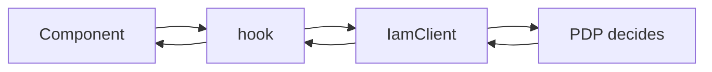

# Core concepts

Five ideas carry the whole SDK. Understand these and every other page is detail.

## 1. The PDP and the thin client

Laravel IAM is a **Policy Decision Point** (PDP): the single component that owns authorization. Your app never evaluates a policy; it **asks** and the PDP answers. This SDK is the thin client that asks — it serialises a query, calls `POST {baseUrl}/decisions/check`, normalises the answer, and exposes it to React. No roles, conditions, or relationships are interpreted on the device.

> The decision is **always** the server's. The client's only opinion is _what to do when it can't get one_ — and that opinion is **deny**.

## 2. Fail-closed — and loading is deny

The governing invariant: **on any uncertainty, deny.** Network error, timeout, non-2xx, malformed body, missing subject, unverifiable token — all resolve to `deny`. The React twist: **a check in flight is also uncertainty**, so the hooks start in `{ allowed: false, loading: true }` and only flip to `allowed: true` on a positive, granted decision. A screen never flashes a privileged control during the round-trip.

::: callout warning "There is no fail-open switch" icon:lock
You cannot configure this SDK to allow on error. The deny path is the **shape** of the code, not a default you can flip. See [Fail-closed by design](/concepts/fail-closed).
:::

## 3. The normalised `Decision`

Every check resolves to the same shape, whatever the server returns:

| Field | Type | Meaning |
|---|---|---|
| `allowed` | `boolean` | The PDP's raw verdict. **Not** sufficient on its own. |
| `requiresStepUp` | `boolean` | `true` → only permitted at a higher assurance level. |
| `requiredAal` | `string \| null` | The assurance level needed (e.g. `aal2`). |
| `policyVersion` | `number` | Monotonic policy generation; bumps invalidate the cache. |
| `decisionId` | `string` | Server correlation id for audit. |
| `matched` | `DecisionMatch[]` | Which rules matched (diagnostics). |
| `explanation` | `string[]` | Human/debug reasons (e.g. `transport`, `no-subject`). |

The fail-safe reduction is `isGranted(decision) = allowed && !requiresStepUp`. The hooks apply it for you; imperative callers should use `can()` or `isGranted()`, never bare `allowed`. See [The decision model](/concepts/decision-model) and [Step-up & AAL](/concepts/step-up-aal).

## 4. Provider + hooks

React-side, the SDK is a **provider** and **three hooks**:

- **`IamProvider`** puts a configured `client` and the current `subject` into context.
- **`usePermission(permission, resource?)`** — pulls the subject from context; the everyday check.
- **`useCan(query)`** — you supply a full `DecisionQuery`; full control.
- **`useIam()`** — returns `{ client, subject }` for imperative calls.

All three permission paths share one fail-closed state machine (loading → deny → granted/denied) and cancel stale responses on re-render. See [The hook lifecycle](/concepts/hook-lifecycle).

## 5. RN-safe: no `node:crypto`

Hermes has no `node:*` modules. This package therefore re-implements the Node SDK's transport, cache and token verification in a React Native-safe way:

- The decision **cache key is canonical JSON** (sorted keys, recursive), not a `node:crypto` SHA-256.
- **Token verification uses Web Crypto** (`globalThis.crypto.subtle`) via `jose`, not Node crypto.
- The Node SDK is imported **`import type` only**, so its runtime (and its `node:crypto`) never loads.

See [RN-safe: no node:crypto](/concepts/rn-safe).

## Where this goes next

::: grids
  ::: grid
    ::: card "Fail-closed by design" icon:shield
    The invariant, formalised, with the threat model. **[Read →](/concepts/fail-closed)**
    :::
  :::
  ::: grid
    ::: card "The hook lifecycle" icon:activity
    The loading → deny → allow state machine, and why it's safe. **[Read →](/concepts/hook-lifecycle)**
    :::
  :::
  ::: grid
    ::: card "Wire contract" icon:file-json
    The exact bytes on the wire, shared with PHP/Node. **[Read →](/architecture/wire-contract)**
    :::
  :::
:::
