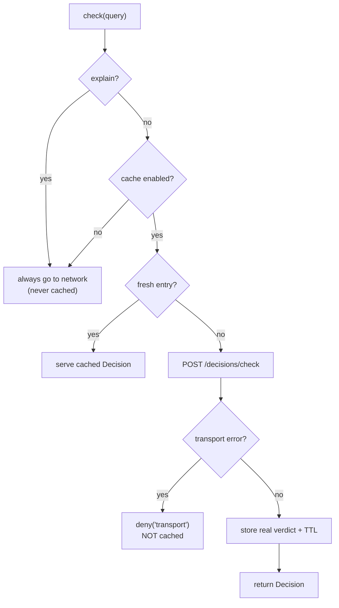

# Caching decisions

A mobile UI re-checks the same permissions constantly — every re-render, every list row, every navigation. The opt-in decision cache makes the repeats free, **without** ever letting a stale or synthetic verdict turn a deny into an allow.

## Motivation

`usePermission` already skips a refetch when the query is unchanged (it keys its effect on a stable serialisation). But across **components** — ten rows each asking `doc.read`, a header and a screen both asking `panel.view` — the same query still hits the network once per caller. A short-lived cache on the client collapses those into one round-trip while a TTL keeps verdicts fresh.

## Turn it on

The cache is **off by default**. Enable it on the client:

```ts
const iam = new IamClient({
  baseUrl: 'https://iam.example.com/api/iam/v1',
  token: process.env.IAM_SERVICE_TOKEN,
  cache: { ttlMs: 5000, maxEntries: 1000 }, // 5s TTL, ≤1000 entries (default cap 1000)
});
```

| Option | Default | Meaning |
|---|---|---|
| `ttlMs` | `0` (off) | Time-to-live per entry, in ms. `> 0` enables the cache. |
| `maxEntries` | `1000` | Bound on stored entries; oldest is evicted first (FIFO). |

## How the key works (RN-safe)

The Node SDK hashes the query with `node:crypto` SHA-256. Hermes has no `node:crypto`, so this SDK keys on a **canonical JSON** string of the full payload instead — keys sorted, recursive, order-independent.

```ts
// cacheKey({ permission: 'p', subject: { id: 'u', type: 'user' } })
// → '{"permission":"p","subject":{"id":"u","type":"user"}}'   (stable regardless of input order)
```

Functionally identical to the hashed key for an in-memory `Map`: the same query always maps to the same entry. See [RN-safe: no node:crypto](/concepts/rn-safe).

## What is — and isn't — cached



Three rules keep the cache safe:

- **Transport-error denies are never stored.** A deny born of an outage must not outlive it. Only real server verdicts enter the cache.
- **`explain` queries bypass the cache entirely** — both on read and write — so a diagnostic call always reflects the live policy.
- **A newer `policyVersion` flushes everything.** When the server returns a higher policy generation than the cache has seen, the whole cache is cleared before the new entry is stored — a policy change can't be shadowed by stale entries.

## The policy-version flush, formally

Let $p_c$ be the highest `policyVersion` the cache has observed and $p_d$ the version on an incoming decision. On `set`:

$$
p_d > p_c \;\Rightarrow\; \text{clear the cache, then } p_c \leftarrow p_d
$$

So the maximum staleness of any **allow** is bounded by $\min(\texttt{ttlMs},\ \text{time to the next policy bump})$ — and a revocation that bumps the policy version is reflected on the very next decision.

## Worked example: a list that checks once, not per row

```tsx
// client has cache: { ttlMs: 5000 }
function DocRow({ doc }: { doc: Document }) {
  const { allowed } = usePermission('doc.read', { type: 'document', id: doc.id });
  return allowed ? <Text>{doc.title}</Text> : null;
}
```

Distinct `doc.id`s still produce distinct keys (one check each), but a re-render, a scroll that remounts rows, or two components asking the **same** `{permission, resource, subject}` now serve from cache for 5 seconds — no extra network calls, same fail-closed verdicts.

## ADR: a cache that can only shorten the life of an allow

::: collapsible "Problem → Decision → Consequences"
**Problem.** A naive cache can serve a stale **allow** after a revocation, or cache a transport-error deny and later be mistaken for a real verdict — both break the invariant in the dangerous direction.

**Decision.** The cache is off by default; when on it stores **only** real verdicts (never transport errors), skips `explain`, keys on the canonical-JSON of the full query, bounds size with FIFO eviction, and flushes wholesale on a newer `policyVersion`.

**Consequences.** The cache can only ever shorten the life of a stale allow (bounded by `ttlMs`, zeroed by a policy bump) and can never manufacture one. Latency relief without weakening fail-closed. See [Caching safely](/best-practices/caching-safely).
:::

## Gotchas

::: callout warning "TTL is a freshness/latency trade — keep it short"
A longer `ttlMs` means fewer calls but a longer window in which a just-revoked permission still reads as allowed (until the next policy bump). Seconds, not minutes. For anything sensitive, prefer a very short TTL or no cache.
:::

::: callout warning "The cache is in-memory and per-client"
It doesn't persist across app restarts and isn't shared between client instances. On a shared device, construct a new client (or `clear()` the cache) on logout so one user's verdicts can't be served to another.
:::

## Next steps

- [Caching safely](/best-practices/caching-safely) — choosing TTLs and the revocation story.
- [The decision model](/concepts/decision-model) — what `policyVersion` is and why it flushes.
- [RN-safe: no node:crypto](/concepts/rn-safe) — the canonical-JSON key.
