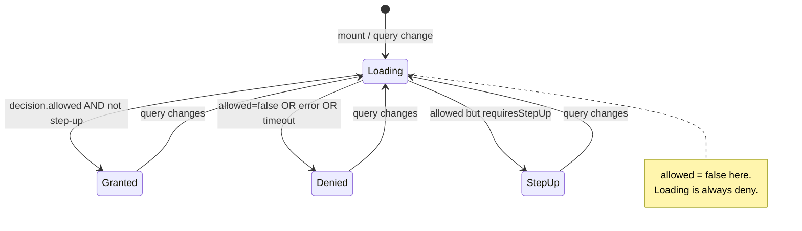

# Checking permissions with hooks

The point of this SDK is one line in a component: _"may the current user do this?"_ — answered by the server, rendered fail-closed. Two hooks do it.

## Motivation

In a mobile UI you don't want to hand-roll a `useState` + `useEffect` + `fetch` + cancellation + step-up reduction every time you gate a button. You also don't want any of those hand-rolls to accidentally render a privileged control while the check is still loading. `usePermission` and `useCan` encapsulate the whole fail-closed state machine so you can't get it wrong.

## Pick the right hook

::: grids
  ::: grid
    ::: card "usePermission(permission, resource?, extra?)" icon:scale
    The everyday hook. Reads the `subject` from `IamProvider`. You supply a permission string and optionally a resource. **Use this 90% of the time.**
    :::
  :::
  ::: grid
    ::: card "useCan(query)" icon:sliders-horizontal
    The full-control hook. You pass a complete `DecisionQuery` — your own subject, `application`, `context`, `organization`, even `explain`. Use it when you need a subject other than the provider's, or extra query fields.
    :::
  :::
:::

Both return the same `PermissionState`:

```ts
interface PermissionState {
  allowed: boolean;        // true only when PDP granted AND no step-up pending. false while loading.
  loading: boolean;        // true while the check is in flight
  requiresStepUp: boolean; // true when allowed-but-needs-higher-AAL
}
```

## `usePermission` — the everyday case

```tsx
import { usePermission } from '@padosoft/laravel-iam-react-native';

function PublishButton({ docId }: { docId: string }) {
  const { allowed, loading } = usePermission('doc.publish', { type: 'document', id: docId });

  if (loading) return <ActivityIndicator />;
  if (!allowed) return null;
  return <Button title="Publish" onPress={onPublish} />;
}
```

- The `resource` can be a `Resource` object (`{ type, id }`), a `string`, or omitted/`null`.
- If the provider has **no subject** (e.g. logged-out), the hook **denies immediately without any network call** — fail-closed for anonymous users.
- `extra` lets you add the rest of a query without leaving the convenience hook: `usePermission('orders.approve', { type: 'order', id }, { application: 'sales', context: { amount } })`.

## `useCan` — full control

```tsx
import { useCan } from '@padosoft/laravel-iam-react-native';

function AdminPanelLink() {
  const { allowed, loading } = useCan({
    subject: { type: 'user', id: currentUserId },
    application: 'admin',
    permission: 'panel.view',
    context: { tenant: 'acme' },
  });

  if (loading || !allowed) return null;
  return <Link to="/admin">Admin</Link>;
}
```

`useCan` accepts the same `DecisionQuery` the imperative `client.check()` takes — see [Wire contract](/architecture/wire-contract) for every field.

## The state machine



The hook starts in `Loading` (`allowed: false`), and on every change of the query it returns to `Loading` first. It only ever reaches `Granted` (`allowed: true`) through a positive, fresh, non-step-up decision.

## Handling step-up

`allowed === false` while `requiresStepUp === true` means: _the policy would allow this, but only at a higher authenticator assurance level_. Prompt the user to step up, then re-check.

```tsx
function TransferButton({ amount }: { amount: number }) {
  const { allowed, loading, requiresStepUp } = usePermission(
    'funds.transfer', null, { context: { amount } },
  );

  if (loading) return <ActivityIndicator />;
  if (requiresStepUp) return <Button title="Confirm with biometrics" onPress={promptStepUp} />;
  if (!allowed) return null;
  return <Button title="Transfer" onPress={onTransfer} />;
}
```

See [Step-up & AAL](/concepts/step-up-aal) for the model.

## ADR: why the hooks key on a stable serialisation

::: collapsible "Problem → Decision → Consequences"
**Problem.** A `DecisionQuery` is an object literal — its reference changes on every render. Putting it directly in a `useEffect` dependency array would re-fire the check on every render (an infinite-ish loop of network calls).

**Decision.** The hooks compute a **canonical JSON** serialisation of all query inputs (`stableKey`) and use that string as the effect dependency, not the object. Identical queries across renders produce the same key and skip the refetch; a genuine change re-runs the check.

**Consequences.** You can pass inline object literals freely (`usePermission('p', { type: 't', id })`) without memoising them. The cost is a cheap stringify per render — negligible next to a network round-trip. This is the same canonical-JSON technique the decision cache uses for its key (see [RN-safe](/concepts/rn-safe)).
:::

## Worked example: a resource list where each row self-authorises

```tsx
function DocumentRow({ doc }: { doc: Document }) {
  const canEdit = usePermission('doc.edit', { type: 'document', id: doc.id });
  const canDelete = usePermission('doc.delete', { type: 'document', id: doc.id });

  return (
    <Row>
      <Text>{doc.title}</Text>
      {canEdit.allowed && <IconButton name="edit" onPress={() => edit(doc)} />}
      {canDelete.allowed && <IconButton name="trash" onPress={() => remove(doc)} />}
    </Row>
  );
}
```

Each row asks the PDP independently and renders its actions fail-closed. Turn on the [decision cache](/guides/caching) so repeated permissions across rows don't each hit the network, and consider [list-resources](/guides/list-resources) when the server can return the authorised set in one call.

## Gotchas

::: callout warning "Don't treat loading as a neutral state"
`loading: true` carries `allowed: false`. Render a spinner or render nothing — **never** render the privileged action "optimistically" during loading. That would reintroduce a fail-open flash.
:::

::: callout warning "Don't gate on bare allowed when step-up matters"
`usePermission` already applies `isGranted` (so `allowed` excludes step-up). But if you read the decision imperatively via `useIam().client.check()`, reduce it yourself with `can()` / `isGranted()` — never branch on raw `decision.allowed`.
:::

## Next steps

- [The IamProvider](/guides/provider) — where the client and subject come from.
- [The hook lifecycle](/concepts/hook-lifecycle) — the state machine in depth.
- [Caching decisions](/guides/caching) — make repeated checks cheap.
- [Provider & Hooks API](/reference/hooks) — exact signatures.
