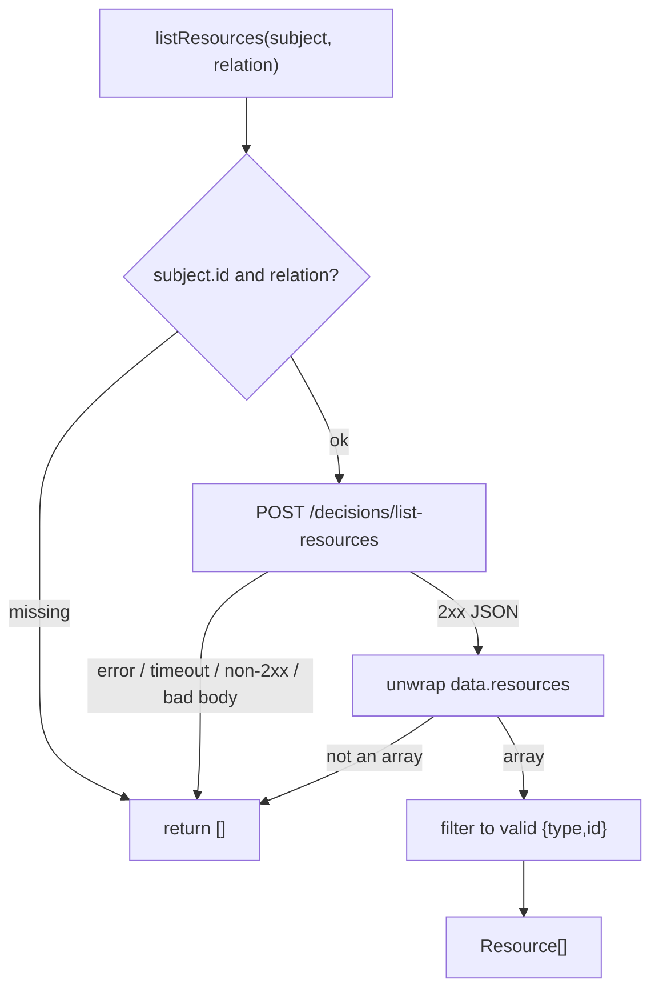

# ReBAC list-resources

A permission check answers _"can this subject act on **this** resource?"_. Sometimes you need the inverse: _"**which** resources is this subject related to?"_ — for example, every warehouse a user can manage. That's `listResources`.

## Motivation

Rendering a list where each row independently asks `usePermission` is correct but chatty — N rows means up to N checks. When the relationship is the thing you're listing by (ReBAC — Relationship-Based Access Control), the server can return the authorised set in **one** call. `listResources` is that call.

## The call

```ts
import { useIam } from '@padosoft/laravel-iam-react-native';

const { client, subject } = useIam();
const warehouses = await client.listResources(subject!, 'manager');
// → Resource[]  e.g. [{ type: 'warehouse', id: 'wh_milan' }, { type: 'warehouse', id: 'wh_rome' }]
```

Signature: `listResources(subject: { type?, id }, relation: string): Promise<Resource[]>`. It POSTs to `{baseUrl}/decisions/list-resources` with `{ subject, relation }`, unwraps the `{ data: { resources } }` envelope, and returns only well-formed `{ type, id }` entries.

## Fail-closed: an empty array, never a throw

::: callout warning "[] means 'deny / nothing', never 'no restriction'" icon:shield-alert
`listResources` returns `[]` on **every** uncertainty — missing subject, empty relation, network error, timeout, non-2xx, malformed body, or a genuinely empty set. Like `check()`, it never throws. Treat `[]` as _"show nothing"_, **never** as _"no filter, show everything"_. Inverting that is the classic fail-open mistake.
:::



## When to use it (and when not)

::: grids
  ::: grid
    ::: card "Use listResources" icon:list-checks
    You're rendering a collection **defined by** a relationship ("warehouses I manage", "projects I own") and want one round-trip instead of N checks.
    :::
  :::
  ::: grid
    ::: card "Use usePermission per row" icon:scale
    The list already comes from elsewhere and you only need to toggle per-row **actions** (edit/delete) — gate each action with the hook (and the [cache](/guides/caching)).
    :::
  :::
:::

## Worked example: filter a fetched list to the authorised set

```tsx
function useManagedWarehouses() {
  const { client, subject } = useIam();
  const [ids, setIds] = useState<Set<string> | null>(null); // null = loading

  useEffect(() => {
    let cancelled = false;
    if (!subject) { setIds(new Set()); return; } // fail-closed: nothing
    client.listResources(subject, 'manager').then((rs) => {
      if (!cancelled) setIds(new Set(rs.map((r) => r.id)));
    });
    return () => { cancelled = true; };
  }, [client, subject]);

  return ids;
}

function WarehouseList({ all }: { all: Warehouse[] }) {
  const managed = useManagedWarehouses();
  if (managed === null) return <ActivityIndicator />;        // loading = deny
  const visible = all.filter((w) => managed.has(w.id));      // [] → empty list, fail-closed
  return <FlatList data={visible} renderItem={renderWarehouse} />;
}
```

Note the loading sentinel (`null`) renders a spinner — the list never flashes the full set before the authorised subset arrives.

## ADR: list-resources mirrors check()'s fail-closed value contract

::: collapsible "Problem → Decision → Consequences"
**Problem.** A list endpoint could throw on transport failure. Callers under pressure would `catch` and "show everything" to avoid an empty screen — a silent fail-open that exposes resources.

**Decision.** `listResources` never throws; every failure folds into `[]`. It also validates each entry's shape, dropping anything that isn't `{ type: string, id: string }`.

**Consequences.** There is no exception to mishandle, and `[]` is the only failure shape — which renders as an empty (safe) list. The cost is that "no access" and "couldn't reach the PDP" both look like `[]` at the call site; distinguish them with your own loading/error tracking around the call, never by branching authorization. See [Fail-closed by design](/concepts/fail-closed).
:::

## Next steps

- [Checking permissions with hooks](/guides/checking-permissions) — the per-resource counterpart.
- [Caching decisions](/guides/caching) — make per-row checks cheap when you don't list.
- [Wire contract](/architecture/wire-contract) — the `list-resources` payload and envelope.
