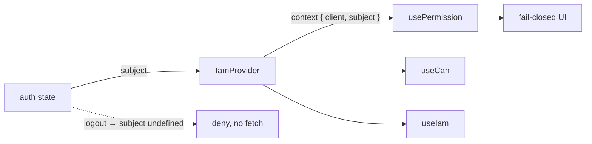

# The IamProvider

Every hook in this SDK reads two things from React context: the **client** (how to reach the PDP) and the **subject** (who the user is). `IamProvider` is what puts them there.

## Motivation

You construct exactly **one** `IamClient` per app — it holds the base URL, the service token, the timeout, the JWKS cache and the decision cache. Re-creating it per render would throw away the caches and the in-memory JWKS. The provider holds that single instance and the current user, so any component, however deep, can ask a permission without prop-drilling a client.

## Mount it once, at the root

```tsx
import { IamClient, IamProvider } from '@padosoft/laravel-iam-react-native';

const iam = new IamClient({
  baseUrl: 'https://iam.example.com/api/iam/v1',
  token: process.env.IAM_SERVICE_TOKEN,
  cache: { ttlMs: 5000 },
  verify: { audience: 'warehouse-app' },
});

export default function App() {
  const { user } = useAuth();
  return (
    <IamProvider client={iam} subject={user ? { type: 'user', id: user.id } : undefined}>
      <RootNavigator />
    </IamProvider>
  );
}
```

::: callout tip "Construct the client outside the component" icon:box
Create `iam` at module scope (or memoise it). Don't `new IamClient(...)` inside the render body — a fresh instance each render discards the JWKS and decision caches.
:::

## The props

| Prop | Type | Required | Description |
|---|---|---|---|
| `client` | `IamClient` | yes | The single configured client instance. |
| `subject` | `Subject \| undefined` | no | The authenticated user (`{ type?, id }`). `usePermission` uses it automatically. |
| `children` | `ReactNode` | no | Your app tree. |

A `Subject` is `{ type?: string; id: string }`. When `type` is omitted, the wire defaults it to `'user'`.

## Reading context with `useIam`

For imperative work — `client.verifyToken`, `client.listResources`, or a one-off `client.check` outside a hook — read the context directly:

```tsx
import { useIam } from '@padosoft/laravel-iam-react-native';

function useResources(relation: string) {
  const { client, subject } = useIam();
  return useCallback(async () => {
    if (!subject) return [];
    return client.listResources(subject, relation);
  }, [client, subject, relation]);
}
```

::: callout danger "useIam throws outside a provider" icon:triangle-alert
`useIam()` (and therefore `usePermission` / `useCan`) throws `useIam must be called inside <IamProvider>` if there is no provider above it. This is deliberate: a missing provider is a wiring bug, not a silent no-op.
:::

## Swapping the subject on login / logout

Drive `subject` from your auth state. When it changes, the hooks re-key and re-check automatically.

```tsx
function Root() {
  const { user } = useAuth();
  // subject becomes undefined on logout → usePermission denies immediately, no network call
  const subject = user ? { type: 'user', id: user.id } : undefined;
  return (
    <IamProvider client={iam} subject={subject}>
      <RootNavigator />
    </IamProvider>
  );
}
```



::: callout warning "After logout, also clear sensitive cached decisions" icon:eraser
Changing `subject` stops new checks for the old user, but the opt-in **decision cache lives on the client** and is keyed by the full query (subject included), so a different subject simply misses the cache. If you reuse one device across users and want to be strict, construct a fresh client (or call its cache `clear()`) on logout. See [Caching safely](/best-practices/caching-safely).
:::

## ADR: a provider that holds an instance, not config

::: collapsible "Problem → Decision → Consequences"
**Problem.** The provider could take raw config (`baseUrl`, `token`, …) and build the client internally. That would couple the React tree to construction and re-build the client (and lose its caches) whenever a prop changed.

**Decision.** `IamProvider` takes an already-constructed `client` instance. Construction (and its validation, e.g. the absolute-URL check) happens once, where you control it; the provider only distributes it.

**Consequences.** One client, one set of caches, for the app's lifetime. Tests can inject a client with a mock `fetch`. The cost is one extra line (`new IamClient(...)`) at the call site — a fair price for a stable instance.
:::

## Next steps

- [Checking permissions with hooks](/guides/checking-permissions) — use the context the provider sets up.
- [Caching decisions](/guides/caching) — the cache lives on the client the provider holds.
- [Provider & Hooks API](/reference/hooks) — exact prop and return types.
