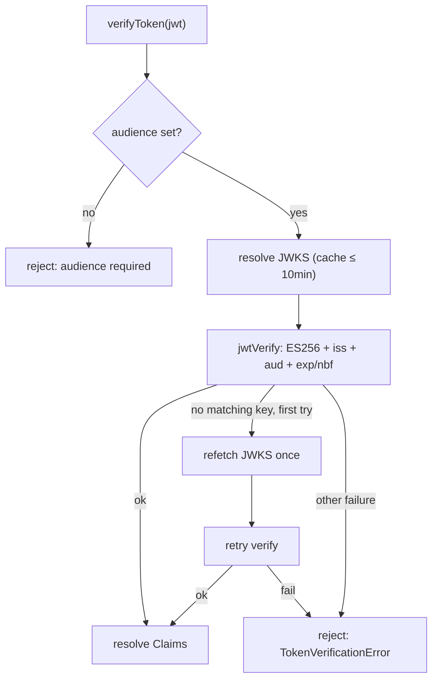

# Verifying tokens (JWKS)

`check()` answers _"may this subject act?"_. `verifyToken()` answers the other half — _"is this token genuine?"_ — by checking an **ES256** signature and the standard claims against the server's published keys.

## Motivation

When your app receives an access or ID token from the IAM server (or from an OIDC flow it brokers), you must not trust its claims until you've verified the signature and that the token was minted **by your issuer, for your audience, and is still valid**. `verifyToken` does this offline against the JWKS — no introspection round-trip per request — and fails closed on anything it can't confirm.

## The call

```ts
const claims = await iam.verifyToken(jwt); // resolves Claims, or rejects (the deny signal)
// claims: { sub, iss, aud, exp, iat, ... }
```

`verifyToken` **rejects** (throws `TokenVerificationError`) on any failure: bad signature, wrong `iss`/`aud`, expired/not-yet-valid, unreachable or malformed JWKS, or a malformed token string. Unlike `check()`, it does **not** return a value on failure — a token has no safe fallback, so rejection is the unambiguous fail-closed signal.

```ts
import { TokenVerificationError } from '@padosoft/laravel-iam-react-native';

try {
  const claims = await iam.verifyToken(jwt);
  // trust claims.sub, claims.org, ...
} catch (e) {
  if (e instanceof TokenVerificationError) {
    // fail-closed: treat as unauthenticated. e.reason is a short cause breadcrumb.
    return signOut();
  }
  throw e;
}
```

## Audience is mandatory — by design

::: callout danger "verifyToken refuses to run without an audience" icon:shield-alert
`jose` **silently skips** the `aud` check when no expected audience is supplied. In a cluster that shares one issuer and signing key, a token minted for service A would then verify for service B — a confused-deputy hole. So `verifyToken` **throws** if neither `verify.audience` (client default) nor `options.audience` (per call) is set. Absent audience is a verification failure, not accept-any.
:::

Set it once on the client, or per call:

```ts
// once, on the client
const iam = new IamClient({ baseUrl, verify: { audience: 'warehouse-app' } });
await iam.verifyToken(jwt);

// or per call (overrides/satisfies the requirement)
await iam.verifyToken(jwt, { audience: 'warehouse-app' });
```

## Issuer and JWKS resolution

`verifyToken` resolves three things, each overridable per call via `options`:

| What | Default | Override |
|---|---|---|
| **Algorithm** | pinned to `['ES256']` | — (not configurable; ES256 only) |
| **Audience** | `verify.audience` | `options.audience` (**required** if no default) |
| **Issuer** | the **origin** of `baseUrl` (e.g. `https://iam.example.com`) | `verify.issuer` / `options.issuer` |
| **JWKS URI** | `<origin>/.well-known/jwks.json` | `verify.jwksUri` / `options.jwksUri` |

The fetched JWKS is cached in memory for **10 minutes** per URI, so repeated verifications don't re-fetch keys.

## Key rotation: one automatic refetch

If the token's `kid` doesn't match any cached key (the server rotated its signing key), `verifyToken` **refetches the JWKS once** and retries before giving up — so a rotation doesn't cause a thundering wave of failures.



## The Hermes / Web Crypto caveat

`jose` verifies ES256 using the **Web Crypto API** (`globalThis.crypto.subtle`). On Hermes that exists from **React Native 0.71+** and in Expo.

::: callout warning "If crypto.subtle is missing, verifyToken can't run" icon:triangle-alert
On older Hermes, some bare RN builds, or non-Hermes setups without Web Crypto, `crypto.subtle` may be undefined and `verifyToken` will reject. Two safe options:

1. **Polyfill Web Crypto** before the first call (e.g. a `SubtleCrypto` shim / `react-native-quick-crypto`).
2. **Verify server-side** (token introspection) and use only `check()` / hooks on the device — these need only `fetch`, never crypto.

This is the single most common deployment surprise — see [Hermes & Web Crypto](/best-practices/hermes-web-crypto) for the decision tree.
:::

## ADR: rejection (not a value) is the right fail-closed signal for tokens

::: collapsible "Problem → Decision → Consequences"
**Problem.** `check()` returns a deny `Decision` on failure precisely so callers can't fail open by mishandling an exception. Why does `verifyToken` throw instead?

**Decision.** A failed verification has **no safe value** to return — there are no trustworthy claims. Returning `null`/`{}` would invite callers to read fields off it. So `verifyToken` rejects with `TokenVerificationError`, and the only correct handling is "treat as unauthenticated".

**Consequences.** The deny signal is unambiguous and impossible to read past. The cost is that you must wrap calls in `try/catch` (or `.catch`) — but there's no permissive shape to leak. See [Fail-closed by design](/concepts/fail-closed).
:::

## Gotchas

::: callout warning "Don't fall back to allow in the catch block"
`catch (e) { /* continue as authenticated */ }` undoes the whole guarantee. The catch block must lead to a denied/unauthenticated path.
:::

::: callout warning "Algorithm is ES256 only"
Tokens signed with RS256/HS256/etc. will reject. This SDK pins `['ES256']` to match the IAM server's signing — there is no algorithm option, by design (an `alg`-confusion mitigation).
:::

## Next steps

- [Hermes & Web Crypto](/best-practices/hermes-web-crypto) — runtime requirements and polyfills.
- [RN-safe: no node:crypto](/concepts/rn-safe) — why verification uses Web Crypto, not Node crypto.
- [Errors](/reference/errors) — `TokenVerificationError` in detail.
