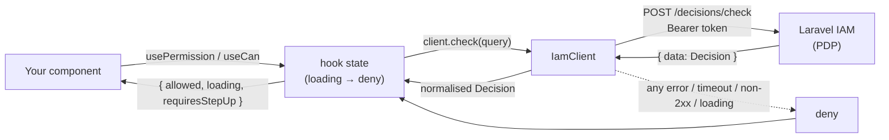

# laravel-iam-react-native

> **Ask the IAM server _"is this user allowed to do this?"_ from inside your React Native app — and let your UI render fail-closed while it waits. Same wire contract as the PHP and Node clients; no policy logic on the device; loading is always deny.**

[](https://www.npmjs.com/package/@padosoft/laravel-iam-react-native)
[](https://github.com/padosoft/laravel-iam-react-native/actions/workflows/tests.yml)
[](https://github.com/padosoft/laravel-iam-react-native/blob/main/LICENSE)

`@padosoft/laravel-iam-react-native` is the **React Native / React SDK** for [Laravel IAM](https://github.com/padosoft) — an Identity & Authorization control plane (a **Policy Decision Point**, PDP) for multi-application ecosystems. Your mobile app still needs to ask it _"may this user act?"_ and verify the tokens it mints. This package is the thin, fail-closed client that does exactly that — plus a `IamProvider` and three hooks (`useIam`, `useCan`, `usePermission`) that make permission checks one line of idiomatic React.

::: callout info "New here? Read this page top to bottom" icon:compass
In a few minutes you'll know what this SDK is, the one rule that governs everything it does (**fail-closed, loading included**), the React surface (a provider + three hooks), why it's safe on Hermes (**no `node:crypto`**), and where to click next. Every other page goes deeper — this one is the whole picture.
:::

---

## What it is — in one minute

A **PDP** is the component that owns authorization: your app asks _"is subject S allowed to do P on resource R?"_ and the PDP answers `allow` or `deny`. Laravel IAM is that PDP. The decision logic — RBAC roles, ABAC conditions, ReBAC relationships, step-up requirements — lives **entirely on the server**.

This SDK is a **thin client** over two server surfaces, wrapped in a React-friendly skin:

- **`POST {baseUrl}/decisions/check`** — the authorization question. You send a subject, a permission, an optional resource and context; you get back a normalised `Decision`. The hooks turn that into reactive UI state.
- **JWKS token verification** — the authentication question. You hand it an access/ID token; it verifies the **ES256** signature and the `iss` / `aud` / `exp` / `nbf` claims against the server's published keys, using Web Crypto.

There is **no PDP logic in this package**. It never interprets a grant, never evaluates a policy, never decides anything on the device. It serialises your query to the exact wire format the PHP and Node clients use, calls the server, normalises the answer, and exposes it to React. That is the entire job — and the discipline that keeps it safe.

> **In one line:** _the shortest path from "my screen needs to honour our IAM" to "my screen renders fail-closed against our IAM" — same contract as PHP/Node, zero policy duplication, RN-safe._

---

## Built on `@padosoft/laravel-iam-node` — but nothing of it runs on the device

This SDK reuses the **wire types** of the Node SDK (`Subject`, `Resource`, `Decision`, `DecisionQuery`, `Claims`, …) so a polyglot fleet shares one contract. Crucially, those imports are **`import type` only** — completely erased at build time. **No Node SDK runtime code is ever bundled or executed in your app.** The transport, the cache and the token verification are re-implemented here in a **React Native-safe** way (the cache key is canonical JSON, not a `node:crypto` SHA-256).

::: callout tip "Why a separate package and not just the Node SDK?" icon:smartphone
Hermes — React Native's JS engine — has **no `node:*` modules**. Importing `node:crypto` (even transitively) crashes at runtime. This package keeps the contract and the fail-closed guarantees of the Node SDK while staying inside the RN sandbox. See [RN-safe: no node:crypto](/concepts/rn-safe).
:::

---

## The one rule: fail-closed (loading included)

Everything in this SDK bends to a single invariant:

> **On any uncertainty — a network error, a timeout, a non-2xx response, a malformed body, a missing subject, an unverifiable token, _or a check still in flight_ — the answer is `deny`. Never `allow`.**

There is no fail-open switch. An unreachable PDP must never open the doors, and a screen must never flash a privileged control during the network round-trip. The hooks **start in the denied state** and only ever flip to `allowed: true` on a positive, fresh, granted decision. Read [Fail-closed by design](/concepts/fail-closed) and [The hook lifecycle](/concepts/hook-lifecycle) for the full theory.

::: callout warning "`allowed === true` is not yet permission" icon:shield-alert
When a decision carries `requiresStepUp: true`, the action is only permitted at a higher assurance level — treat it as **not yet allowed**. The hooks apply `isGranted()` for you: `allowed` is only `true` when the PDP granted **and** no step-up is pending. See [Step-up & AAL](/concepts/step-up-aal).
:::

---

## The React surface

::: grids
  ::: grid
    ::: card "IamProvider" icon:plug
    Put a configured `IamClient` (and the current user `subject`) into React context once, at the root. Every hook below reads from it. **[The IamProvider →](/guides/provider)**
    :::
  :::
  ::: grid
    ::: card "usePermission(permission, resource?)" icon:scale
    The everyday hook: pass a permission (and optional resource); it pulls the `subject` from context and returns `{ allowed, loading, requiresStepUp }`. **[Checking permissions →](/guides/checking-permissions)**
    :::
  :::
  ::: grid
    ::: card "useCan(query)" icon:sliders-horizontal
    The full-control hook: pass a complete `DecisionQuery` (own subject, application, context, explain). Same fail-closed state machine. **[Checking permissions →](/guides/checking-permissions)**
    :::
  :::
  ::: grid
    ::: card "useIam()" icon:box
    Escape hatch: returns `{ client, subject }` from the nearest provider for imperative calls (`client.check`, `client.verifyToken`, `client.listResources`). **[Provider & Hooks API →](/reference/hooks)**
    :::
  :::
:::

---

## Why it's different

::: grids
  ::: grid
    ::: card "Fail-closed by construction" icon:lock
    Any network error, timeout, 5xx, 4xx, malformed body, unverifiable token — **and the loading state itself** — resolve to **deny**, never allow. No fail-open opt-out exists in the API surface.
    :::
  :::
  ::: grid
    ::: card "Idiomatic React hooks" icon:atom
    `usePermission` / `useCan` integrate with context, cancel stale responses on re-render, and expose a tiny `{ allowed, loading, requiresStepUp }` state — one line to gate a button or a screen.
    :::
  :::
  ::: grid
    ::: card "RN-safe by design" icon:smartphone
    No `node:crypto`, no Node built-ins. The decision cache keys on **canonical JSON**; token verification uses `jose` over **Web Crypto** (`globalThis.crypto.subtle`).
    :::
  :::
  ::: grid
    ::: card "Drop-in parity with PHP & Node" icon:git-compare
    Same slash endpoint, same payload (`current_aal` snake-case, explicit nulls), Bearer auth, `{ data }` envelope unwrap, and deny-on-error semantics. The server can't tell the callers apart.
    :::
  :::
  ::: grid
    ::: card "Mandatory audience on tokens" icon:badge-check
    `verifyToken` refuses to run without an `audience`: `jose` silently skips the `aud` check otherwise, so a token minted for a sibling service would verify. Absent audience → reject, fail-closed.
    :::
  :::
  ::: grid
    ::: card "A cache that can't turn deny into allow" icon:database
    The opt-in decision cache stores the server's verdict verbatim, expires on a short TTL, never caches transport errors, skips `explain` queries, and flushes wholesale on a newer `policy_version`.
    :::
  :::
:::

---

## How it fits together

A component renders; a hook asks the client; the client serialises and calls the PDP; the PDP decides; the client normalises; the hook reduces to fail-safe React state. The verdict is always the server's, and the UI is denied until it arrives.



---

## Start in 60 seconds

::: steps
1. **Install**
   ```bash
   npm install @padosoft/laravel-iam-react-native
   ```
   Needs React 18+. `verifyToken` needs React Native 0.71+ (Hermes Web Crypto); `check()` / hooks work on any RN with `fetch`.

2. **Provide the client at the root**
   ```tsx
   import { IamClient, IamProvider } from '@padosoft/laravel-iam-react-native';

   const iam = new IamClient({
     baseUrl: 'https://iam.example.com/api/iam/v1', // full API base, incl. route prefix
     token: process.env.IAM_SERVICE_TOKEN,
     cache: { ttlMs: 5000 },
   });

   export default function App() {
     return (
       <IamProvider client={iam} subject={{ type: 'user', id: userId }}>
         <Navigation />
       </IamProvider>
     );
   }
   ```

3. **Gate a control with a hook**
   ```tsx
   import { usePermission } from '@padosoft/laravel-iam-react-native';

   function AdjustStockButton({ warehouseId }: { warehouseId: string }) {
     const { allowed, loading } = usePermission('stock.adjust', { type: 'warehouse', id: warehouseId });
     if (loading) return <ActivityIndicator />;
     if (!allowed) return null; // fail-closed
     return <Button title="Adjust stock" onPress={onAdjust} />;
   }
   ```
:::

**[→ Quickstart](/quickstart)** · **[→ Installation](/installation)** · **[→ Core concepts](/core-concepts)**

---

## Ecosystem

This SDK is one client in the **Laravel IAM** family. The server is the PDP; every other package is a way to consume or extend it.

::: grids
  ::: grid
    ::: card "laravel-iam-server" icon:server
    The IAM server: identity, org, Application Registry + manifest, PDP (RBAC + ABAC + ReBAC), OAuth/OIDC, tamper-evident audit, IGA, Admin API + panel. **[Docs →](https://doc.laravel-iam-server.padosoft.com)**
    :::
  :::
  ::: grid
    ::: card "laravel-iam-node" icon:hexagon
    Core Node/TypeScript SDK (`@padosoft/laravel-iam-node`) — this package builds on its wire types. **[Docs →](https://doc.laravel-iam-node.padosoft.com)**
    :::
  :::
  ::: grid
    ::: card "laravel-iam-contracts" icon:file-code
    Shared contracts/interfaces + DTOs (PDP, KeyProvider, Assurance, FeatureScope). **[Docs →](https://doc.laravel-iam-contracts.padosoft.com)**
    :::
  :::
  ::: grid
    ::: card "laravel-iam-client" icon:plug
    The Laravel client for consumer apps: OIDC login, JWT/JWKS verify, introspection, `iam.auth`/`iam.can` middleware, Gate adapter, policy cache, webhook receiver. **[Docs →](https://doc.laravel-iam-client.padosoft.com)**
    :::
  :::
  ::: grid
    ::: card "laravel-iam-rust" icon:cog
    Rust client SDK (crate `laravel-iam`), async + blocking, fail-closed. **[Docs →](https://doc.laravel-iam-rust.padosoft.com)**
    :::
  :::
  ::: grid
    ::: card "More modules" icon:boxes
    `laravel-iam-ai` (advisory-only AI), `laravel-iam-directory` (LDAP/AD), `laravel-iam-bridge-spatie-permission` (migration bridge). **[Org →](https://github.com/padosoft)**
    :::
  :::
:::

---

## Where to go next

::: grids
  ::: grid
    ::: card "Quickstart" icon:zap
    A working screen gated on a PDP permission, end to end. **[Open →](/quickstart)**
    :::
  :::
  ::: grid
    ::: card "Fail-closed by design" icon:shield
    The invariant, the threat model, and why loading is deny. **[Read →](/concepts/fail-closed)**
    :::
  :::
  ::: grid
    ::: card "Provider & Hooks API" icon:book-marked
    Every prop, hook, and returned field, with exact types and behaviour. **[Reference →](/reference/hooks)**
    :::
  :::
:::

::: callout tip "Package facts" icon:info
npm `@padosoft/laravel-iam-react-native` · React `>=18`, React Native `>=0.71` (for `verifyToken`) · deps: `jose` + `@padosoft/laravel-iam-node` (types only) · ESM + CJS + types · MIT ·
[GitHub](https://github.com/padosoft/laravel-iam-react-native) · [npm](https://www.npmjs.com/package/@padosoft/laravel-iam-react-native)
:::
