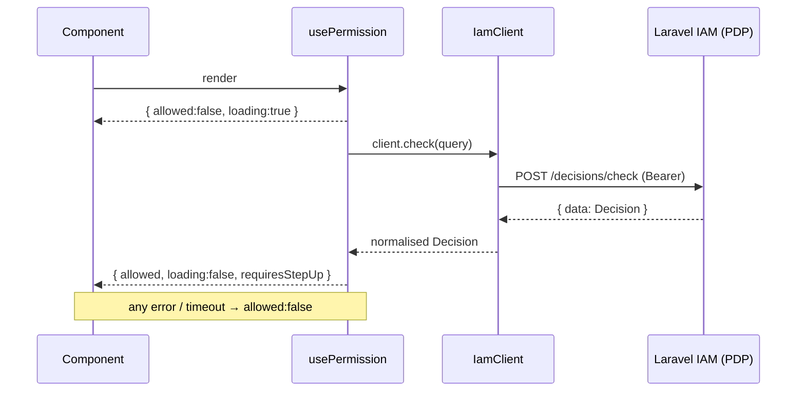

# Quickstart

This page takes you from nothing to a working, **fail-closed** permission check inside a React Native (or React) app. Five minutes, four steps.

::: callout info "What you need" icon:list-checks
A running Laravel IAM server reachable from the device, its **API base URL** (including the route prefix, e.g. `https://iam.example.com/api/iam/v1`), and a **service token** (OAuth2 Client Credentials) for your app. For `verifyToken`, React Native **0.71+** (Hermes with Web Crypto).
:::

## 1. Install

```bash
npm install @padosoft/laravel-iam-react-native
# or: yarn add / pnpm add / expo install
```

The only runtime dependencies are [`jose`](https://github.com/panva/jose) (JWKS / ES256 over Web Crypto) and the **type-only** import of `@padosoft/laravel-iam-node`. Nothing from the Node SDK ships in your bundle.

## 2. Construct one client and provide it

Create a single `IamClient` for the app and put it — together with the current user `subject` — into React context at the root.

```tsx
// iam.ts
import { IamClient } from '@padosoft/laravel-iam-react-native';

export const iam = new IamClient({
  baseUrl: 'https://iam.example.com/api/iam/v1', // full API base, incl. /api/iam/v1
  token: process.env.IAM_SERVICE_TOKEN,          // service token → Authorization: Bearer
  timeoutMs: 2000,                               // fail-closed deadline (default 2s)
  cache: { ttlMs: 5000 },                        // optional, opt-in
  verify: { audience: 'warehouse-app' },         // mandatory audience for verifyToken
});
```

```tsx
// App.tsx
import { IamProvider } from '@padosoft/laravel-iam-react-native';
import { iam } from './iam';

export default function App() {
  const userId = useAuth().userId; // however you track the signed-in user

  return (
    <IamProvider client={iam} subject={{ type: 'user', id: userId }}>
      <RootNavigator />
    </IamProvider>
  );
}
```

::: callout warning "`baseUrl` must be absolute" icon:link
`new IamClient({ baseUrl: 'iam.example.com' })` **throws at construction** — a relative URL would silently disable the issuer check on `verifyToken`. Always pass a full `https://…` URL including the route prefix.
:::

## 3. Gate a control with `usePermission`

The everyday hook. Give it a permission and (optionally) a resource; it reads the `subject` from context and returns reactive state.

```tsx
import { ActivityIndicator, Button } from 'react-native';
import { usePermission } from '@padosoft/laravel-iam-react-native';

function AdjustStockButton({ warehouseId }: { warehouseId: string }) {
  const { allowed, loading } = usePermission(
    'stock.adjust',
    { type: 'warehouse', id: warehouseId },
  );

  if (loading) return <ActivityIndicator />; // never render the action while loading
  if (!allowed) return null;                  // fail-closed: hide what the user can't do
  return <Button title="Adjust stock" onPress={onAdjust} />;
}
```

The button **starts hidden** (loading is deny), shows a spinner during the round-trip, and only renders when the PDP granted the permission and no step-up is pending.

## 4. Verify a token (optional)

If your app receives an access/ID token from the IAM server, verify it before trusting its claims.

```ts
import { useIam } from '@padosoft/laravel-iam-react-native';
import { TokenVerificationError } from '@padosoft/laravel-iam-react-native';

function useVerifiedClaims(jwt: string) {
  const { client } = useIam();
  return async () => {
    try {
      const claims = await client.verifyToken(jwt); // audience comes from client `verify`
      return claims; // { sub, iss, aud, exp, ... }
    } catch (e) {
      if (e instanceof TokenVerificationError) return null; // fail-closed
      throw e;
    }
  };
}
```

## The whole flow at a glance



## Next steps

- [Installation](/installation) — peer deps, Hermes, Expo, and platform notes.
- [Core concepts](/core-concepts) — the five ideas the rest of the docs build on.
- [Checking permissions with hooks](/guides/checking-permissions) — `useCan`, `usePermission`, patterns.
- [The IamProvider](/guides/provider) — one client, context, swapping the subject on login/logout.
